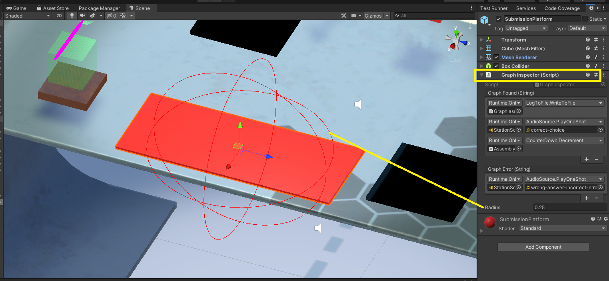
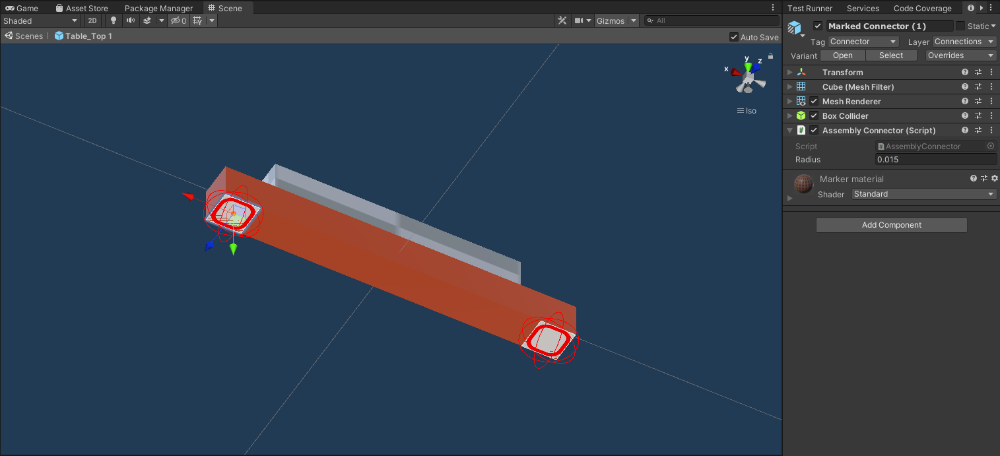
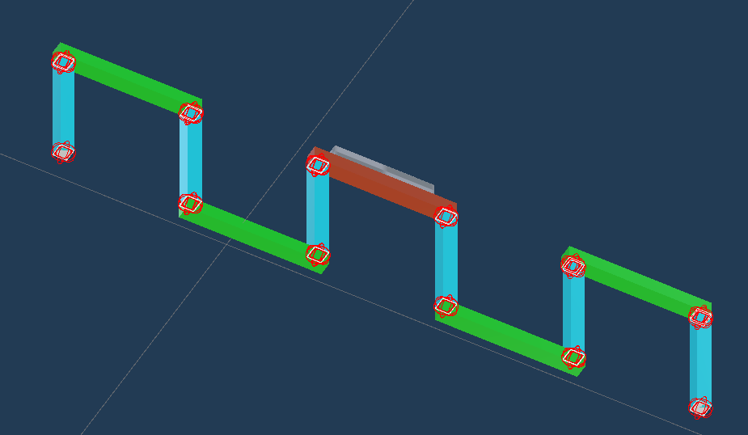

# AssemblyGraph_unity_module

This module adds the assembly graph components to Unity.

## How to use it
Attach a `GraphInspector` component to the workstation surface. The radius adjusts reach of the inspection.  The red-sphere gizmo visualizes this.

Attach a `RootComponent` to a gameobject and place it on the workstation surface. You can also attach `AssemblyComponent` to other gameobjects.

Attach `AssemblyConnectors` to these components.

Execute the "GraphInspector.BuildAndDestroy" to begin the process. Usually a button is used to execute the method.

An example assembly.

## The C# dll

There is a pure C# dll that was used here. The dll was compiled from [this library](https://github.com/Steedalion/AssemblyGraph)
